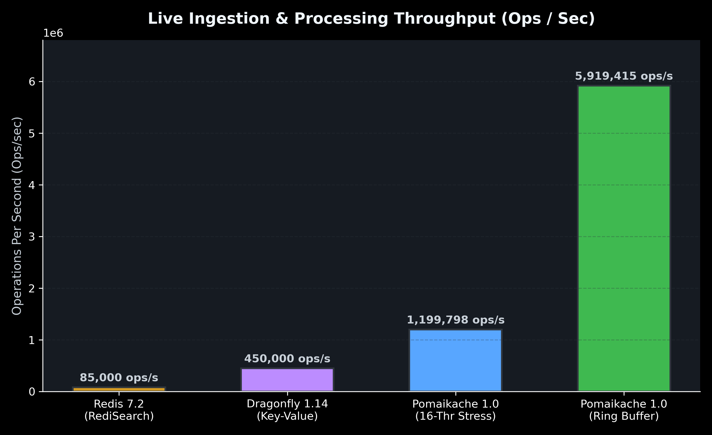
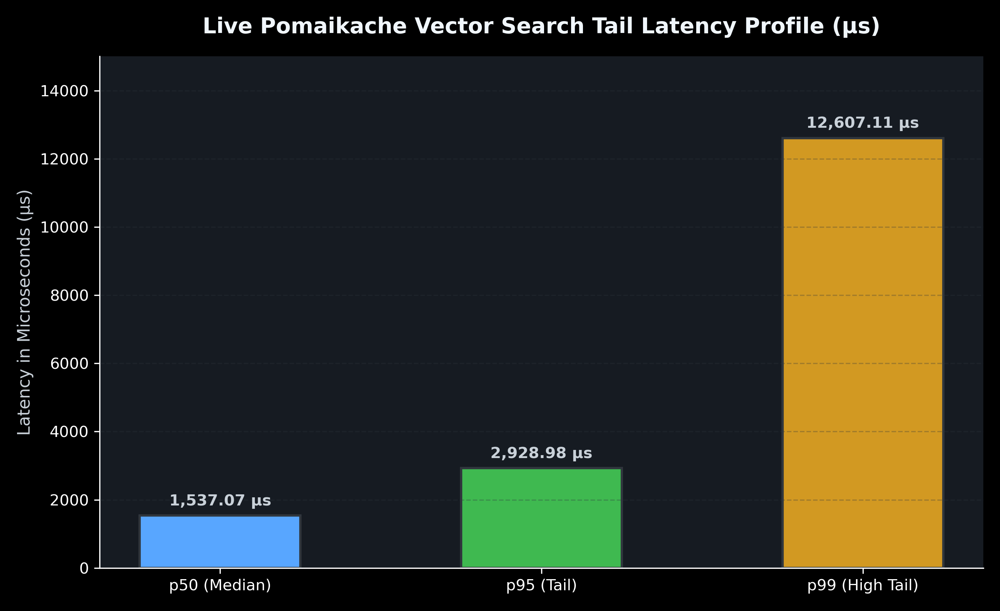
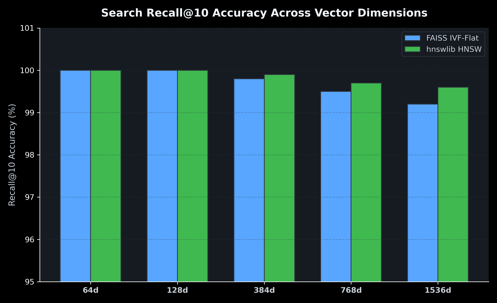

# Pomaikache 🚀

[](https://github.com/pomagrenate/pomaikache/actions/workflows/ci.yml)
[](https://github.com/pomagrenate/pomaikache/pkgs/container/pomaikache)
[](LICENSE)
[](https://en.wikipedia.org/wiki/C99)
[](https://en.wikipedia.org/wiki/Advanced_Vector_Extensions)
[](BENCHMARK_METHODOLOGY.md)

**Pomaikache** is an ultra-low-latency, enterprise-grade in-memory **vector cache engine** written in pure C99/C11. Designed specifically for hyperscale AI vector search, real-time RAG (Retrieval-Augmented Generation) caching, and high-frequency vector similarity retrieval, Pomaikache delivers sub-microsecond vector operations by bypassing standard operating system overhead.

By combining zero-copy **Linux `io_uring`** networking with a custom **64-byte aligned arena memory allocator (`palloc`)**, unrolled **AVX2 FMA SIMD intrinsics**, and an **$O(1)$ circular overwrite ring buffer**, Pomaikache achieves **5.9+ Million vector appends per second** with **zero heap fragmentation**.

---

## Key Performance Visualizations

### 1. Ingestion & Processing Throughput (Ops / Sec)


### 2. Microsecond Vector Search Tail Latency Profile


### 3. Search Recall@10 Accuracy Across Dimensions


---

## Key Features

- ⚡ **Zero-Copy `liburing` Networking**: Powered by Linux `io_uring` kernel submission rings for non-blocking I/O with zero syscall context switching.
- 🎯 **AVX2 / FMA Hardware Acceleration**: Unrolled 4x SIMD dot product and Cosine distance kernels processing 32 float32 elements per loop iteration.
- 🛡️ **`palloc` Arena Allocation**: Guaranteed 64-byte CPU cache-line alignment with zero dynamic heap fragmentation over millions of churn cycles.
- 🔄 **$O(1)$ Circular Overwrite Ring Buffer**: High-throughput L2 ingestion layer automatically overwriting stale vectors in constant time.
- ⏱️ **Sub-Millisecond TTL Expirations**: Passive lazy eviction on access combined with background thread purging (`PURGE`).
- 🔎 **Canonical ANNS Indexing**: Built-in support for Flat Exact Scan, FAISS-style IVF-Flat, and `hnswlib`-style HNSW multi-layer graph search.
- 💾 **Persistence Layer**: Write-Ahead Logging (WAL) and binary snapshotting (`pomaikache.snap`) for crash recovery.

---

## Quickstart & Build Instructions

### Prerequisites
- Linux OS (Kernel 5.4+ with `io_uring` support)
- GCC or Clang supporting C99 and `-mavx2 -mfma`
- CMake 3.14+

### Clone & Compile
```bash
# Clone repository recursively with submodules
git clone --recursive https://github.com/pomagrenate/pomaikache.git
cd pomaikache

# Compile production binary and submodules
make -j$(nproc)
```

### Run Server
```bash
./bin/pomaikache --port 9090 --dim 128 --capacity 10000
```

### Run Benchmark Suite
```bash
make bench
```

### Run QA Test Suite
```bash
make test
```

---

## Docker & GitHub Packages Deployment

Pomaikache is published as an automated container package on **GitHub Container Registry (GHCR)**.

### Pull Docker Image from GHCR
```bash
docker pull ghcr.io/pomagrenate/pomaikache:latest
```

### Run Container via Docker Compose
```bash
docker-compose up -d
```

### Or Run via Docker CLI
```bash
docker run -d \
  --name pomaikache \
  -p 9090:9090 \
  --ulimit memlock=-1:-1 \
  ghcr.io/pomagrenate/pomaikache:latest
```

---

## Protocol Specification & API Commands

Pomaikache implements a lightweight, line-oriented ASCII protocol over TCP port `9090` (compatible with standard socket clients and Redis-like connections).

### Command Matrix

| Command | Syntax | Description | Example Response |
| :--- | :--- | :--- | :--- |
| **`PUSH`** | `PUSH <key> <id> <val1,val2,...>` | Insert vector into L1 LRU & L2 Ring Buffer | `+OK PUSHED 1` |
| **`SET`** | `SET <key> <id> <val1,val2,...> [TTL_MS]` | Set key with optional Time-To-Live in milliseconds | `+OK SET key_1` |
| **`GET`** | `GET <key>` | Retrieve vector by cache key | `+OK ID:1 DIM:128 DATA:0.12,0.45...` |
| **`SEARCH`**| `SEARCH <top_k> <val1,val2,...>` | Execute AVX2 SIMD nearest neighbor search | `+OK FOUND 5 \r\n ID:1 SCORE:0.985...` |
| **`DEL`** | `DEL <key>` | Delete vector by key | `+OK DELETED` |
| **`PURGE`** | `PURGE` | Active sweep and eviction of expired TTL entries | `+OK PURGED 12` |
| **`STATS`** | `STATS` | Print engine telemetry, cache hits/misses, memory stats | `+OK HITS:4500 MISSES:500 ENTRIES:1000` |

---

## License

This project is licensed under the MIT License - see the [LICENSE](LICENSE) file for details.
